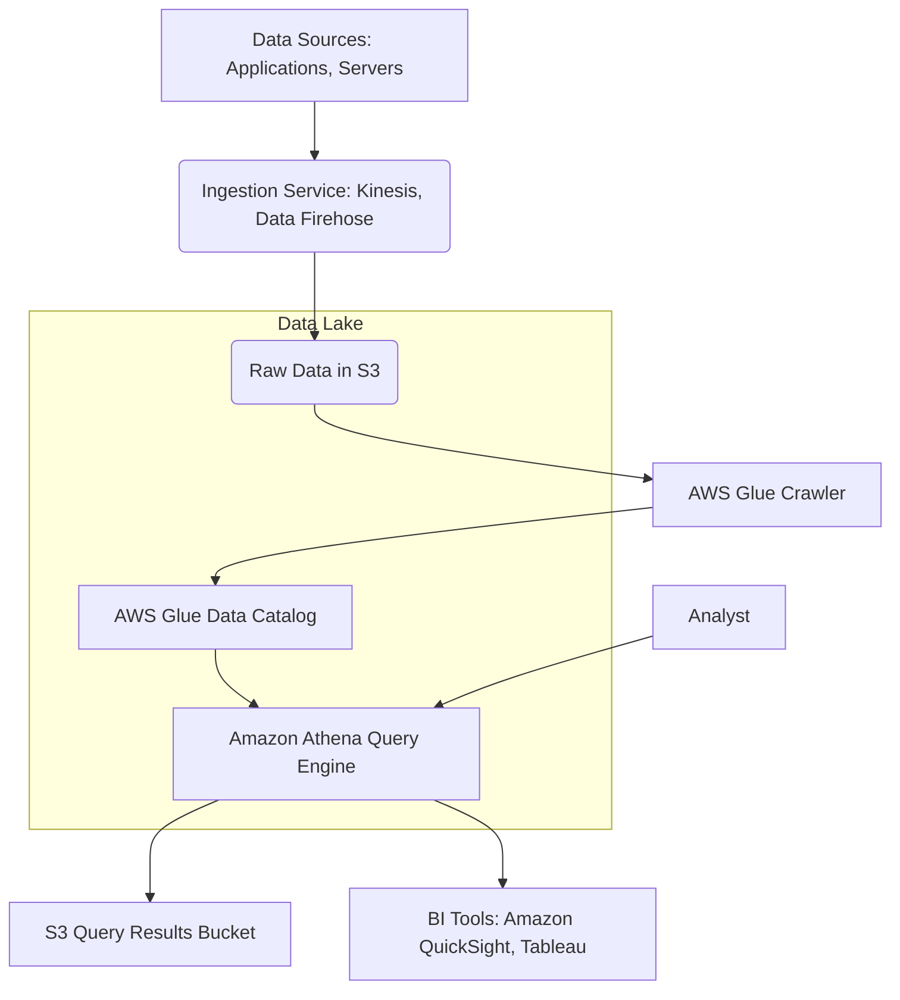

# Athena

### 1\. Overview

Amazon Athena 🛠️ is a serverless, interactive query service that makes it easy to analyze data directly in Amazon S3 using standard SQL. Since it is serverless, there is no infrastructure to set up or manage, and you only pay for the queries you run. Athena works with your data where it lives, allowing you to run powerful analytics on massive datasets without needing to move the data or transform it first. It is an ideal service for building a data lake and performing ad-hoc analysis.

-----

### 2\. Problem Statement & Business Use Cases 📈

A FinTech company needs to analyze vast amounts of transaction logs to detect fraudulent activities in near-real-time. These logs, stored in an S3 data lake, are generated continuously from various applications. The company needs a cost-effective, scalable solution to query this data without the overhead of a traditional data warehouse.

**Industries/Applications:**

  * **FinTech:** Fraud detection, transaction analysis, and regulatory reporting.
  * **E-commerce:** Analyzing website clickstreams, user behavior, and sales data for personalization and trend analysis.
  * **IoT:** Processing and querying sensor data from millions of devices for operational insights and anomaly detection.
  * **Healthcare:** Analyzing patient data, lab results, and medical device telemetry for research and operational efficiency.

-----

### 3\. Core Principles

  * **Serverless:** You don't need to provision, manage, or scale any servers. AWS handles all the underlying infrastructure, allowing you to focus on your queries.
  * **Query-on-Read:** Athena uses a "schema-on-read" approach. It doesn't require you to pre-process or load data into a database. You simply define a schema (the structure of your data) using a table definition, and Athena applies this schema when it runs your SQL query against the data in S3.
  * **Scalability:** Athena automatically scales its query execution engine to handle complex queries on large datasets, running queries in parallel to deliver results quickly.
  * **Cost-Effective:** You are billed based on the amount of data scanned per query. By optimizing your data format and partitioning, you can significantly reduce costs.

-----

### 4\. Pre-Requirements

To implement this solution, you will need the following AWS services and tools:

  * **Amazon S3:** A durable and scalable object storage service to act as your data lake, storing raw log files. 🛠️
  * **AWS Glue Data Catalog:** A managed metadata repository that stores the schema and location of your data. Athena uses this catalog to understand how to query the data in S3. 🛠️
  * **AWS Glue Crawler:** A tool that automatically scans your S3 data, infers the schema, and populates the AWS Glue Data Catalog. 🛠️
  * **Amazon Athena:** The interactive query service itself.
  * **AWS IAM:** To manage access control and permissions for users and services to interact with S3 and Athena. 🛠️
  * **Amazon QuickSight (Optional):** A business intelligence service to visualize Athena query results and build dashboards. 📊

-----

### 5\. Implementation Steps

1.  **Set up an S3 Bucket:** Create a dedicated S3 bucket to store your raw log data. It's a best practice to organize your data with a logical folder structure, for example: `s3://your-data-lake/raw-logs/year=YYYY/month=MM/day=DD/`.
2.  **Upload Data:** Ingest your log data (e.g., in CSV, JSON, or Parquet format) into the S3 bucket.
3.  **Configure AWS Glue Crawler:**
      * Navigate to the AWS Glue console and create a new crawler.
      * Specify the S3 bucket path as the data source.
      * Choose an IAM role that grants the crawler permission to read from S3 and write to the Glue Data Catalog.
      * Run the crawler. It will analyze your data files, infer the schema, and create a table definition in the Glue Data Catalog.
4.  **Query Data with Athena:**
      * Go to the Amazon Athena console.
      * Select the database and table created by the AWS Glue crawler.
      * Write and run standard SQL queries against your data. For example: `SELECT count(*) FROM "fraud_detection_db"."transaction_logs" WHERE transaction_amount > 10000;`
5.  **Store Query Results:** Athena automatically stores query results in a designated S3 bucket. You can configure this location in the Athena workgroup settings.

-----

### 6\. Data Flow Diagram

-----

### 7\. Security Measures

  * **IAM Roles:** Use **least privilege** IAM roles for Athena and Glue, granting only the necessary permissions to access specific S3 buckets and data catalogs.
  * **Data Encryption:** Enable **server-side encryption** on your S3 buckets (e.g., SSE-S3 or SSE-KMS) to protect data at rest. You should also configure Athena to encrypt its query results.
  * **VPC Endpoints:** Access Athena and S3 from within a VPC using VPC endpoints to ensure network traffic stays within the AWS network and does not traverse the public internet.
  * **Audit Logging:** Enable AWS CloudTrail to log all API calls made to Athena and S3, providing an audit trail of who is accessing your data and when.
  * **AWS Lake Formation:** For fine-grained access control, integrate Athena with AWS Lake Formation to manage permissions at the table, column, and row levels.

-----

### 8\. Querying Nested JSON Data with Athena

One innovative use case for Amazon Athena is its ability to directly query nested JSON data without complex ETL processes. Many applications generate logs in a JSON format with deeply nested fields. Traditionally, extracting this data would require parsing and flattening the JSON structure, which is a resource-intensive and time-consuming task.

With Athena, you can create a table that defines the nested structure using the `STRUCT` and `ARRAY` data types in your table definition. For example, if your JSON log contains a nested `user` object with `id` and `name` fields, your table schema in the Glue Data Catalog would reflect this hierarchy. You can then use standard SQL dot notation (e.g., `SELECT user.id FROM my_json_table`) to access these nested fields directly in your queries.

This capability is particularly useful for analyzing application logs, user clickstream data, or API request payloads, enabling rapid exploration and analysis of complex data structures.

-----

### 9\. Benefits

  * **Cost Savings:** Pay only for the data scanned, making it significantly more cost-effective for intermittent or ad-hoc queries compared to always-on data warehouses.
  * **Scalability:** Automatically scales to handle massive datasets and complex queries without any user intervention.
  * **Ease of Use:** Uses standard ANSI SQL, so data analysts can get started immediately without learning new tools or languages.
  * **Integration:** Seamlessly integrates with other AWS services like S3, Glue, QuickSight, and Lake Formation, forming the cornerstone of a modern data lake architecture.
  * **Flexibility:** Supports various data formats (CSV, JSON, Parquet, ORC) and can query data from multiple sources (federated queries).

-----

### 10\. Summary

Amazon Athena is a powerful, serverless query engine that simplifies data analysis by allowing you to run standard SQL queries directly on data stored in S3. This solution ensures rapid, cost-effective ad-hoc analytics with minimal infrastructure overhead, making it a cornerstone for modern data lake architectures.

#### Top 5 Things to Keep in Mind about Athena:

1.  **Cost is Based on Data Scanned:** Your bill is directly tied to the amount of data your queries scan. Partitioning and using columnar formats like Parquet are crucial for cost and performance optimization.
2.  **Schema is in Glue:** Athena relies on the AWS Glue Data Catalog for its table definitions. Ensure your Glue Crawler is correctly configured and your schema accurately reflects your data.
3.  **Data is Immutable:** Athena is designed for querying data, not for modifying it. It's a read-only service for your data lake. For data transformations, consider using other services like AWS Glue ETL.
4.  **Performance Tuning:** The way you structure your data in S3 (e.g., partitioning) and the file format you use (e.g., Parquet) have a massive impact on query performance and cost.
5.  **Security is Key:** Secure your S3 buckets and Athena with proper IAM policies, encryption, and VPC endpoints to protect your sensitive data.

-----

**Related Topics/Reference Guidelines:**

  * **AWS Glue:** A fully managed extract, transform, and load (ETL) service.
  * **Amazon QuickSight:** Business intelligence and data visualization service.
  * **AWS Lake Formation:** Service to set up, secure, and manage data lakes.
  * **Amazon S3:** Object storage for your data lake.
  * **Data Lake on AWS:** A reference architecture for building a data lake.