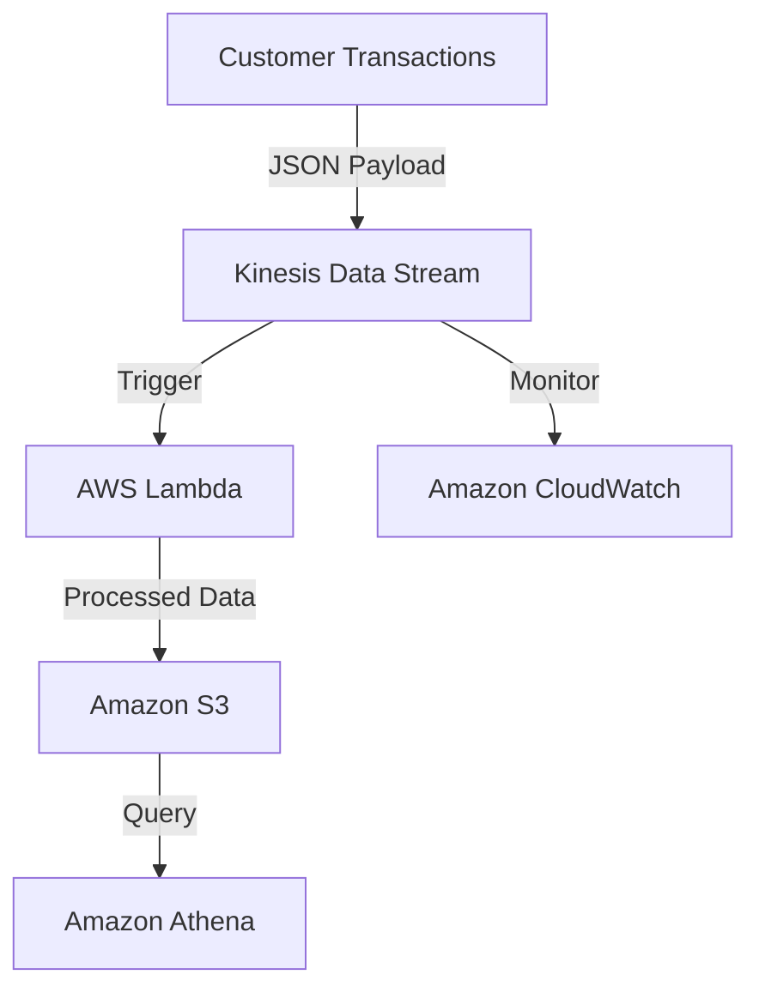

# 🛠️ Amazon Kinesis 

## Title: Real-Time Data Streaming with Amazon Kinesis Data Streams

## Problem Statement & Business Use Cases
A **retail company** wants to analyze customer purchase data in real-time to personalize promotions and optimize inventory. The system must process high-velocity transaction data securely, scale dynamically, and integrate with analytics tools for immediate insights.

**Business Use Cases**:
- **E-commerce**: Personalize customer experiences by analyzing clickstream and purchase data in real-time.
- **IoT**: Process sensor data for predictive maintenance in manufacturing.
- **FinTech**: Monitor real-time stock trades or fraud detection.

---

## Core Principles
Amazon Kinesis Data Streams enables real-time data ingestion, processing, and analysis with low latency. Key principles include:
- **Event-Driven Architecture**: Streams data as events, enabling immediate processing.
- **Scalability**: Automatically scales with shard-based architecture to handle varying data volumes.
- **Durability**: Stores data for up to 7 days (or 365 with extended retention), ensuring no data loss.
- **Low Latency**: Processes data in milliseconds, ideal for time-sensitive applications.

---

## Pre-Requirements
| AWS Service | Purpose |
|-------------|---------|
| **Amazon Kinesis Data Streams** 🛠️ | Ingest and store streaming data in real-time. |
| **AWS Lambda** 🛠️ | Process streaming data for transformations or analytics. |
| **Amazon S3** 🛠️ | Store processed data for long-term analysis. |
| **Amazon CloudWatch** 🛠️ | Monitor stream performance and set alerts. |
| **AWS IAM** 🛠️ | Secure access to Kinesis and other services. |

**Additional Tools**:
- **AWS SDK** (e.g., Python Boto3) for producing and consuming stream data.
- **Amazon Athena** for querying processed data in S3.

---

## Implementation Steps
1. **Create a Kinesis Data Stream** 🚀
   - In the AWS Management Console, navigate to Kinesis > Create Data Stream.
   - Name the stream (e.g., `RetailTransactionStream`) and set the number of shards (e.g., 2 for moderate traffic).
2. **Set Up Data Producers**
   - Use AWS SDK (e.g., Python) to send transaction data to the stream.
   - Example: Send JSON payloads (e.g., `{ "order_id": "123", "amount": 50.99, "timestamp": "2025-08-08" }`).
3. **Configure AWS Lambda for Processing** 🛠️
   - Create a Lambda function (e.g., `ProcessRetailData`) with a Kinesis trigger.
   - Write code to parse and transform data (e.g., aggregate sales by product).
4. **Store Processed Data in S3**
   - Configure Lambda to write processed data to an S3 bucket (e.g., `retail-processed-data`).
   - Use S3 prefixes for organization (e.g., `year=2025/month=08/`).
5. **Set Up CloudWatch Monitoring** 🛠️
   - Enable CloudWatch metrics for Kinesis (e.g., `GetRecords.Latency`, `PutRecord.Success`).
   - Create alarms for high latency or throttling events.
6. **Test the Pipeline**
   - Send sample data via the producer script and verify Lambda processing and S3 storage.
7. **Query Data with Athena** (Optional)
   - Create a table in Athena to query processed data in S3 for insights.

---

## Data Flow Diagram

---

## Security Measures
- **Enable Server-Side Encryption** in Kinesis (e.g., AWS-managed CMK) to protect streaming data.
- **IAM Least Privilege**: Create roles for Lambda and producers with minimal permissions (e.g., `kinesis:PutRecord`, `s3:PutObject`).
- **VPC Endpoints**: Use Kinesis and S3 VPC endpoints to keep traffic within your AWS environment.
- **CloudTrail Logging**: Enable AWS CloudTrail to audit API calls to Kinesis and S3.
- **Data Validation**: Implement input validation in Lambda to prevent processing malicious data.

---

## Benefits
- **Real-Time Insights** 🚀: Process and analyze data in milliseconds for immediate action.
- **Cost-Effective**: Pay only for the shards and storage used in Kinesis.
- **Scalability**: Auto-scale shards to handle spikes in transaction volume.
- **Integration**: Seamlessly integrates with Lambda, S3, and analytics tools like Athena.
- **Durability**: Retains data for up to 7 days, allowing reprocessing if needed.

---

## Summary
Amazon Kinesis Data Streams provides a scalable, low-latency solution for real-time data processing, enabling businesses like retail to deliver personalized experiences and optimize operations. By combining Kinesis with Lambda, S3, and CloudWatch, this architecture ensures secure, cost-effective, and actionable insights with minimal infrastructure overhead. 🚀