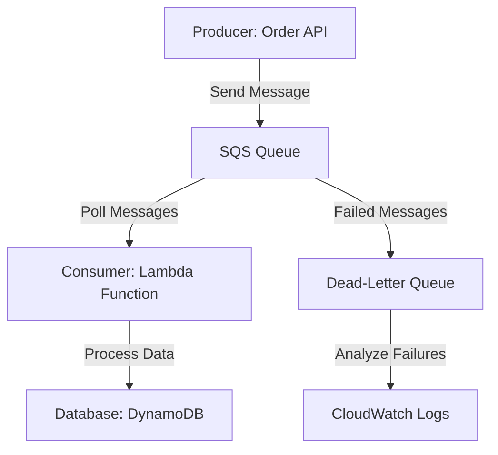

# 📈 Aws SQS


### 1. Core Principles

Amazon Simple Queue Service (SQS) is a fully managed message queuing service that enables decoupling and asynchronous communication between distributed systems, applications, or microservices. SQS allows producers to send messages to a queue, where they are stored until consumers retrieve and process them. Key concepts include:

* **Queue Types**:
  * **Standard Queues**: High throughput, at-least-once delivery, with no guarantee of message order.
  * **FIFO (First-In-First-Out) Queues**: Guarantees message order and exactly-once processing, ideal for scenarios requiring strict sequencing.
* **Message Lifecycle**: Messages are sent to a queue, stored (up to 14 days), retrieved by consumers, and deleted after processing.
* **Visibility Timeout**: Prevents multiple consumers from processing the same message by making it invisible for a set period after retrieval.
* **Dead-Letter Queue (DLQ)**: Stores messages that cannot be processed successfully for later analysis.

SQS integrates seamlessly with other AWS services like Lambda, EC2, and SNS, enabling scalable, reliable messaging.

### 2. Benefits

* **Decoupling**: Separates application components, allowing independent scaling and failure isolation.
* **Scalability**: Handles millions of messages per second with automatic scaling.
* **Reliability**: Ensures message durability with redundant storage across multiple Availability Zones.
* **Cost-Effective**: Pay-per-use pricing with no upfront costs.
* **Flexibility**: Supports both standard and FIFO queues, catering to varied use cases.
* **Ease of Use**: Fully managed, eliminating the need to manage queue infrastructure.

### 3. Implementation Steps

To implement a basic SQS-based solution (e.g., processing customer orders):

1. **Create an SQS Queue**:
   * Navigate to the SQS console in AWS.
   * Choose between Standard or FIFO queue type.
   * Configure settings like visibility timeout (e.g., 30 seconds) and message retention (e.g., 4 days).
   * Optionally, enable a Dead-Letter Queue for failed messages.
2. **Set Up Permissions**:
   * Create an IAM role or policy allowing services (e.g., Lambda, EC2) to send/receive messages.
   * Example policy: Allow `sqs:SendMessage` and `sqs:ReceiveMessage` for the queue ARN.
3.  **Send Messages**:

    * Use AWS SDK (e.g., Python boto3) to send messages from a producer (e.g., an order placement API).

    ```python
    import boto3
    sqs = boto3.client('sqs')
    response = sqs.send_message(
        QueueUrl='https://sqs.<region>.amazonaws.com/<account-id>/<queue-name>',
        MessageBody='{"order_id": "123", "item": "book"}'
    )
    ```
4.  **Receive and Process Messages**:

    * Configure a consumer (e.g., Lambda function) to poll the queue and process messages.

    ```python
    def lambda_handler(event, context):
        sqs = boto3.client('sqs')
        response = sqs.receive_message(
            QueueUrl='https://sqs.<region>.amazonaws.com/<account-id>/<queue-name>',
            MaxNumberOfMessages=10
        )
        for message in response.get('Messages', []):
            # Process message
            sqs.delete_message(
                QueueUrl='https://sqs.<region>.amazonaws.com/<account-id>/<queue-name>',
                ReceiptHandle=message['ReceiptHandle']
            )
    ```
5. **Monitor and Scale**:
   * Use CloudWatch to monitor queue metrics (e.g., `ApproximateNumberOfMessagesVisible`).
   * Adjust consumer scaling (e.g., Lambda concurrency) based on queue depth.

### 4. Business Use Cases/Applications

* **E-commerce Order Processing**: Decouple order placement from inventory updates, sending order details to an SQS queue for asynchronous processing.
* **Media Processing**: Queue video transcoding jobs for scalable processing across multiple workers.
* **IoT Data Ingestion**: Buffer IoT device messages for reliable processing in real-time analytics pipelines.
* **Batch Job Scheduling**: Queue tasks for batch processing, such as data ETL jobs in financial systems.
* **Event-Driven Architectures**: Enable microservices to communicate asynchronously, e.g., notifying a billing service after a user signup.

### 5. Data Flow Diagram



### 6. When to Use and When Not to Use

**When to Use**:

* Need to decouple application components for scalability or reliability.
* Require asynchronous processing for tasks like order processing or job scheduling.
* Need a managed, durable message queue with minimal setup.
* FIFO queues for strict message ordering (e.g., financial transactions).

**When Not to Use**:

* Need real-time, low-latency communication (use WebSockets or AWS AppSync instead).
* Require complex message routing or publish-subscribe patterns (use Amazon SNS).
* Messages need to be processed in a specific order with high throughput (FIFO queues have lower throughput than standard queues).
* Need persistent storage beyond 14 days (use S3 or DynamoDB).

### 7. Best Practices

* **Set Appropriate Visibility Timeout**: Match the timeout to the consumer’s processing time to avoid duplicate processing.
* **Use Dead-Letter Queues**: Configure DLQs to capture and analyze failed messages.
* **Monitor Queue Metrics**: Use CloudWatch to track queue depth and processing delays, setting alarms for anomalies.
* **Optimize Polling**: Use long polling (up to 20 seconds) to reduce empty responses and costs.
* **Secure Queues**: Use IAM policies and queue encryption (SSE with KMS) to protect sensitive data.
* **Batch Operations**: Send, receive, or delete messages in batches to improve efficiency and reduce costs.
* **Handle Failures**: Implement retry logic and exponential backoff for transient errors.

### 8. Summary

Amazon SQS is a powerful, fully managed message queuing service that enables decoupled, scalable, and reliable communication between distributed systems. Its standard and FIFO queue types cater to diverse needs, from high-throughput workloads to strictly ordered processing. By integrating with AWS services like Lambda and DynamoDB, SQS supports a wide range of use cases, including e-commerce, IoT, and batch processing. Following best practices like monitoring, securing queues, and optimizing polling ensures efficient and cost-effective implementations. However, SQS is not ideal for real-time or complex routing scenarios, where alternatives like SNS or WebSockets may be better suited.

> Tag

`SQS`, `event-driven`

  <p onclick="navigator.clipboard.writeText('&#128540;')"  style="font-size:48px">&#128540;</p>